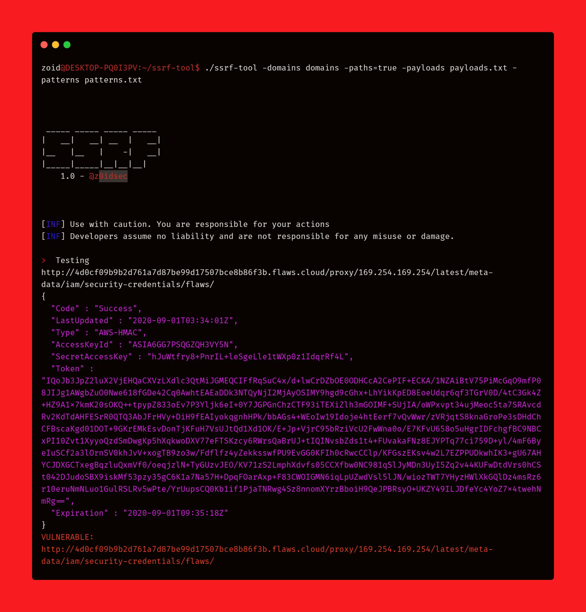

# SSRF Detector Tool

A SSRF detector tool written in golang. I have fixed some errors and added some more payloads into it. But the tool credits goes to [z0idsec](https://twitter.com/z0idsec).

### Upcoming Features
- Fetch endpoints from Javascript files ✅ 
- Bruteforce parameters ✅ 
- Find SSRF in those parameters ✅ 
- Match multiple patterns in the response ✅ 
- Check Post Request ❌
- Check Headers ❌

### Features
- Wordlist Creation
- Inject in every parameter one by one
- Very fast speed
- Inject into paths
- Silent Mode
- Fetch endpoints from Javascript files 
- Bruteforce parameters  
- Find SSRF in those parameters 
- Match multiple patterns in the response

### Note

Make sure when creating wordlists or finding ssrf with my tool that the domains are resolved.
You can use:
- [httpx](https://github.com/projectdiscovery/httpx)
- [httprobe](https://github.com/tomnomnom/httprobe)
- [massdns](https://github.com/blechschmidt/massdns)

To do so. Also, Make sure to customerise your patterns file for greater results.

+ **Installation**

    ```
    go get -u github.com/R0X4R/ssrf-tool
    ```
    
    To install via git clone
    
    ```sh
    git clone https://github.com/R0X4R/ssrf-tool.git
    cd ssrf-tool
    go build ssrftool.go && mv ssrftool /usr/bin/
    ```
    You can also download the precompiled binary file [binary](https://github.com/R0X4R/ssrf-tool/releases)
    
+ **Usage**

    ```sh
    █▀ █▀ █▀█ █▀▀
    ▄█ ▄█ █▀▄ █▀░

        v1.2 - @z0idsec (fixed by @R0X4R)

    [WRN] Use with caution. You are responsible for your actions
    [WRN] Developers assume no liability and are not responsible for any misuse or damage.

    Usage of ./ssrf-tool:
    -append
            Append the payload to the parameter
    -brute
            Brute force parameters against endpoints to find SSRF
    -concurrency int
            Set the concurrency for greater speeds (default 30)
    -domains string
            The list of subdomains
    -gen
            Generate a SSRF wordlist to be used
    -parameters string
            The parameters list
    -paths
            (true or false) for testing paths or parameters
    -pattern string
            Match the response with a pattern (e.g.) 'Success:'
    -patterns string
            Match the response with a list of patterns
    -payloads string
            The payloads list
    -silent
            silent output
    ```
  
    


+ **Find SSRF in paths with Subfinder, httpx**

    ```sh
    subfinder -d yahoo.com -silent | httpx -silent >> domains | ssrf-tool -domains domains -payloads ssrf.txt -silent=false -paths=true -patterns patterns.txt
    ```

    [](https://gyazo.com/4b74c62de553e2cda60e45f51c0fc8a4)

+ **Wordlist Creation**

    ```sh
    echo "https://www.twitter.com" | getJS -complete | ssrf-tool -gen=true
    ```

    Can be used with other tools like subfinder & amass

+ **BruteForce For SSRF**

    ```sh
    echo "https://www.twitter.com" | getJS -complete | ssrf-tool -domains domains -silent=false -brute=true -gen=true -patterns patterns.txt  -parameters params.txt
    ```

+ **Testing The Paths**

    ```sh
    ssrf-tool -domains domains -silent=false -patterns patterns.txt -paths=true  -brute=false -payloads ssrf.txt
    ```

+ **Testing Parameters with waybackurls**

    ```sh
    echo "twitter.com" | waybackurls >> domains  ; ssrf-tool -domains domains -silent=false -paths=false -payloads ssrf.txt
    ```


    [](https://gyazo.com/9e50667879ebc2e2d834d2db8e058cc9)

**Credits:** 
[@z0idsec](https://twitter.com/z0idsec)    [@ethicalhackingplayground](https://github.com/ethicalhackingplayground/)
